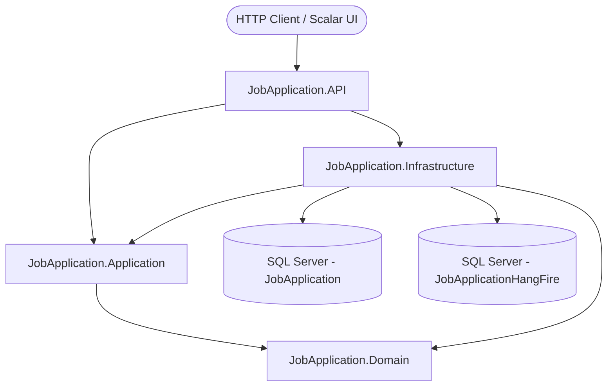
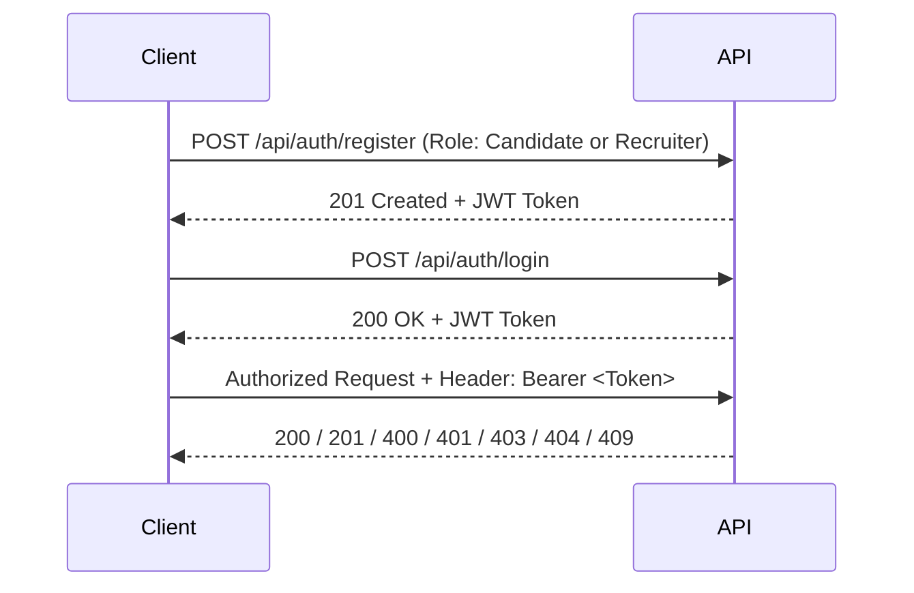
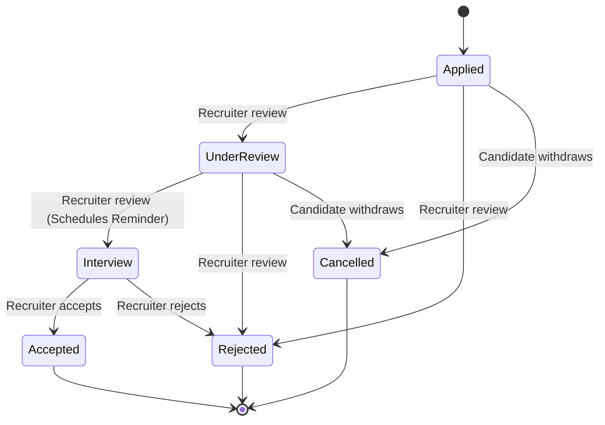

<div align="center">

# 💼 Job Application Management System

**A clean, secure, production-grade REST API where recruiters publish jobs and candidates apply to them — built with Clean Architecture, CQRS (MediatR), JWT Authentication, and Hangfire background processing.**


[Features](#-features) •
[Architecture](#-architecture) •
[CQRS & MediatR](#-cqrs--mediatr) •
[Hangfire & Background Jobs](#-hangfire--background-jobs) •
[Getting Started](#-getting-started) •
[API Reference](#-api-reference) •
[Business Rules](#-business-rules) •
[Roadmap](#-roadmap)

</div>

---

## ✨ Features

| Feature | Description |
|---|---|
| 🔐 **JWT Authentication** | Role-based access control (`Candidate` and `Recruiter`) with claims-based profile resolution |
| 📢 **Job Management** | Create, browse public listings, filter by status, inspect details, update, and soft-close |
| 📝 **Application Tracking** | Submit applications, role-scoped filtering, recruiter lifecycle review, and candidate cancellation |
| 🔄 **CQRS Pattern** | Commands and Queries strictly decoupled using **MediatR** for maintainability and testability |
| ⚡ **Hangfire Processing** | Recurring daily maintenance, fire-and-forget email notifications, and delayed interview reminders |
| 🛡️ **Domain Business Rules** | Duplicate application prevention, valid state machine transitions, ownership validation |
| 🎯 **Result Pattern** | Strongly typed operation results seamlessly translated into standard HTTP status codes |
| 📚 **Interactive API Docs** | Modern, interactive API reference powered by built-in .NET 9 OpenAPI and **Scalar** |

Built as part of a Back-End Development Bootcamp, strictly adhering to the development lifecycle:
**PRD → Epic → User Stories → Backlog Tasks → Clean Architecture Implementation**.

---

## 🧰 Tech Stack

| Area | Technology |
|---|---|
| **Framework** | ASP.NET Core Web API on **.NET 9** |
| **Architecture** | Clean Architecture (Domain, Application, Infrastructure, API) |
| **Design Patterns** | CQRS, MediatR, Repository Pattern, Result Pattern, Dependency Injection |
| **ORM & Database** | Entity Framework Core 9, SQL Server (LocalDB / Express / Docker) |
| **Background Processing** | **Hangfire 1.8.25** (SQL Server Storage + Background Server + Dashboard) |
| **Authentication** | JWT Bearer Authentication, ASP.NET Core `PasswordHasher<T>` |
| **Documentation** | Built-in Microsoft OpenAPI + **Scalar** (`/scalar/v1`) |

---

## 🏗️ Architecture

The solution implements **Clean Architecture** with inward-pointing dependencies. The Domain layer is enterprise-pure and has no external dependencies. The Application layer orchestrates business use cases via CQRS/MediatR. Infrastructure encapsulates persistence, email notifications, and background job scheduling.



### Project Structure

```
JobApplication.sln
├── JobApplication.Domain/            # Pure enterprise models, entities, and lifecycle enums
│   ├── Entities/                     # Job, Candidate, Recruiter, User, JobCandidateApplication
│   └── Enums/                        # JobApplicationStatus, UserRole
│
├── JobApplication.Application/       # Core business logic, CQRS features, DTOs, and interfaces
│   ├── Common/                       # Result<T>, ErrorType abstractions
│   ├── DTOs/                         # Request and response transfer objects
│   ├── Features/                     # CQRS vertical slices (Commands & Queries via MediatR)
│   │   ├── Auth/                     # RegisterCommand, LoginCommand
│   │   ├── Job/                      # CreateJob, UpdateJob, CloseJob, GetAllJobs, GetByIdJob
│   │   └── Jobs/                     # CreateApplication, ReviewApplication, CanceledApplication, GetAll
│   ├── Interfaces/                   # Repository contracts & scheduler abstractions
│   └── Services/                     # Application domain services
│
├── JobApplication.Infrastructure/    # External concerns, EF Core, background workers
│   ├── Auth/                         # JWT token generator, settings
│   ├── Migrations/                   # EF Core database migrations
│   ├── Persistence/                  # ApplicationDbContext, entity mappings
│   ├── Repositories/                 # JobRepository, ApplicationRepository, UserRepository
│   └── Services/                     # HangfireBackgroundJobScheduler, EmailNotificationService, JobCleanupService
│
└── JobApplication.API/               # Presentation layer, controllers, hosting, middleware
    ├── Controllers/                  # AuthController, JobsController, ApplicationsController
    ├── HangfireDashboardAuth.cs      # Dashboard access authorization filter
    ├── Program.cs                    # Composition root, DI, Hangfire & pipeline setup
    └── appsettings.json              # Connection strings and configuration
```

---

## 🔄 CQRS & MediatR

All controller endpoints dispatch requests through **MediatR**, keeping controllers lightweight and separating read operations from write operations:

* **Commands (Write Side):**
  * `RegisterCommand` / `LoginCommand` — User identity and credential verification
  * `CreateJobCommand` / `UpdateJobCommand` / `CloseJobCommand` — Job posting lifecycle
  * `CreateApplicationCommand` — Application submission with duplicate checks
  * `ReviewApplicationCommand` — State machine status transitions
  * `CanceledapplicationCommand` — Candidate application withdrawal

* **Queries (Read Side):**
  * `GetAllQuary` (Jobs) — Filterable public job listings
  * `GetByIdQuery` (Job) — Single job posting details
  * `GetAllApplicationesQuary` — Role-scoped application query

---

## ⚡ Hangfire & Background Jobs

The project includes a robust Hangfire setup using **SQL Server Storage** and a dedicated **BackgroundJobServer** to execute asynchronous, scheduled, and recurring tasks reliably.

### Dashboard Access

The interactive dashboard is accessible at:
👉 **`http://localhost:5018/hangfire`** (or `https://localhost:7237/hangfire`)

It allows real-time inspection of enqueued, scheduled, processing, and succeeded jobs, as well as server health and recurring jobs.

### 1. Recurring Job: Auto-Close Expired Jobs

* **Job ID / Name:** `auto-close-expired-jobs`
* **Trigger Target:** `IJobCleanupService.CloseExpiredJobsAsync()`
* **Cron Expression:** `0 0 * * *` (Equivalent to `Cron.Daily()`)
* **Schedule Meaning:** Runs **every day at 00:00 UTC (midnight)**.
* **Business Purpose:** Automatically scans active job postings and soft-closes (`IsActive = false`) any job created more than 30 days ago (configurable via `Jobs:ExpirationDays`). This keeps the job board fresh, prevents candidates from applying to obsolete vacancies, and maintains database hygiene without manual recruiter intervention.

```csharp
// Program.cs
RecurringJob.AddOrUpdate<IJobCleanupService>(
    "auto-close-expired-jobs",
    service => service.CloseExpiredJobsAsync(CancellationToken.None),
    Cron.Daily());
```

### 2. Fire-and-Forget Background Jobs

Executed immediately in the background without blocking HTTP requests:

* **New Application Notification:**
  Triggered when a candidate submits an application (`CreateApplicationCommandHandler`).
  `_backgroundJobScheduler.Enqueue<INotificationService>(s => s.NotifyRecruiter(app.Id));`
* **Status Change Notification:**
  Triggered when a recruiter updates an application's review status (`ReviewApplicationCommandHandler`).
  `_backgroundJobScheduler.Enqueue<INotificationService>(s => s.NotifyCandidateStatusChanged(app.Id, request.dto.NewStatus));`
* **Application Cancellation Notification:**
  Triggered when a candidate cancels their application (`CanceledapplicationCommandHandler`).
  `_backgroundJobScheduler.Enqueue<INotificationService>(s => s.NotifyApplicationCancelled(app.Id));`

### 3. Delayed Background Jobs

Scheduled to execute after a specified time window:

* **Interview Preparation Reminder:**
  When a recruiter transitions an application to `Interview` status, Hangfire schedules a reminder for the candidate:
  `_backgroundJobScheduler.Schedule<INotificationService>(s => s.SendInterviewReminder(app.Id), TimeSpan.FromMinutes(2));`
  *(Set to 2 minutes in development for immediate test verification; can be set to 24-48 hours before the interview in production).*

---

## 🚀 Getting Started

### Prerequisites

- [.NET 9 SDK](https://dotnet.microsoft.com/download/dotnet/9.0)
- SQL Server (LocalDB `(localdb)\ProjectModels`, SQL Express, or Docker SQL Server)
- EF Core CLI: `dotnet tool install --global dotnet-ef`

### 1. Clone the repository

```bash
git clone https://github.com/MoSayed335/JobApplication.API
cd JobApplication.API
```

### 2. Database Connection

The application uses SQL Server for both the domain database and Hangfire storage. Connection strings in `appsettings.json`:

```json
"ConnectionStrings": {
  "DefaultConnection": "Data Source=(localdb)\\ProjectModels;Initial Catalog=JobApplication;Integrated Security=True;Connect Timeout=30;Encrypt=False;Trust Server Certificate=False;Application Intent=ReadWrite;Multi Subnet Failover=False",
  "HangfireConnection": "Data Source=(localdb)\\ProjectModels;Initial Catalog=JobApplicationHangFire;Integrated Security=True;Connect Timeout=30;Encrypt=False;Trust Server Certificate=False;Application Intent=ReadWrite;Multi Subnet Failover=False"
}
```

### 3. Apply Migrations

```bash
dotnet ef database update --project JobApplication.Infrastructure --startup-project JobApplication.API
```

*(Hangfire automatically creates its own database tables on first launch if they don't already exist).*

### 4. Run the API

```bash
dotnet run --project JobApplication.API
```

### 5. Access Interactive Documentation & Dashboard

* **Scalar API Reference:** [http://localhost:5018/scalar/v1](http://localhost:5018/scalar/v1)
* **OpenAPI Specification:** [http://localhost:5018/openapi/v1.json](http://localhost:5018/openapi/v1.json)
* **Hangfire Dashboard:** [http://localhost:5018/hangfire](http://localhost:5018/hangfire)
* **Hangfire Recurring Jobs:** [http://localhost:5018/hangfire/recurring](http://localhost:5018/hangfire/recurring)

---

## 🔑 Authentication Flow



* User tokens embed claims for `role` and `profileId` (`CandidateId` or `RecruiterId`).
* Identity is resolved server-side from claims via `ApiControllerBase.ProfileId` — preventing client tampering.

---

## 📡 API Reference

### 🔐 Authentication

| Method | Endpoint | Access | Description |
|---|---|---|---|
| `POST` | `/api/auth/register` | 🌐 Public | Register new user (`role`: 1 = Candidate, 2 = Recruiter) |
| `POST` | `/api/auth/login` | 🌐 Public | Authenticate user and receive JWT token |

### 📢 Jobs

| Method | Endpoint | Access | Description |
|---|---|---|---|
| `POST` | `/api/jobs` | 👔 Recruiter | Create a new job posting |
| `GET` | `/api/jobs?isActive=true` | 🌐 Public | List jobs (optionally filtered by active state) |
| `GET` | `/api/jobs/{id}` | 🌐 Public | Get job posting by ID |
| `PUT` | `/api/jobs/{id}` | 👔 Recruiter (owner) | Update job title and description |
| `PUT` | `/api/jobs/{id}/close` | 👔 Recruiter (owner) | Soft-close job posting (`IsActive = false`) |

### 📝 Applications

| Method | Endpoint | Access | Description |
|---|---|---|---|
| `POST` | `/api/applications` | 🙋 Candidate | Apply to an active job (enqueues recruiter notification) |
| `GET` | `/api/applications?jobId=&status=` | 🔒 Authenticated | Filter applications (Candidates see own; Recruiters see jobs' apps) |
| `PUT` | `/api/applications/{id}/review` | 👔 Recruiter (owner) | Advance application status (enqueues status update + interview reminder) |
| `DELETE` | `/api/applications/{id}` | 🙋 Candidate (owner) | Cancel application (enqueues cancellation notice) |

---

## 📋 Business Rules & State Machine

* **Active Application Rule:** Candidates can only apply to jobs where `IsActive == true`.
* **Duplicate Prevention:** A candidate cannot submit multiple active applications for the same job.
* **Ownership Enforcement:** Recruiters can only modify, close, or review applications for jobs they own.
* **Cancellations:** Candidates can only cancel applications in `Applied` or `UnderReview` state.
* **Soft Deletes:** Closing a job preserves all submitted applications and records.

### Application Lifecycle Flow



---

## 🚦 HTTP Status Codes

| Code | Status | Scenarios |
|---|---|---|
| `200` | OK | Successful query, status update, or cancellation |
| `201` | Created | Resource successfully created (registration, job, application) |
| `400` | Bad Request | Validation error, invalid lifecycle status transition |
| `401` | Unauthorized | Missing, expired, or invalid JWT Bearer token |
| `403` | Forbidden | Calling an endpoint without required role or ownership |
| `404` | Not Found | Target job or application does not exist |
| `409` | Conflict | Duplicate email, duplicate application, job already closed |

---

## 🗺️ Roadmap & Implemented Milestones

- [x] **Day 1:** PRD, Backlog, and Requirements Definition
- [x] **Day 2:** Clean Architecture Layering & EF Core Persistence
- [x] **Day 3:** JWT Authentication & Role-Based Authorization
- [x] **Day 4:** CQRS Implementation with MediatR Handlers
- [x] **Day 5:** OpenAPI Specification & Scalar Interactive Documentation
- [x] **Final Take-Home Task:**
  - [x] Hangfire Background Job Infrastructure & SQL Server Storage
  - [x] Recurring Job (`auto-close-expired-jobs`) with Cron schedule
  - [x] Fire-and-forget notification jobs for applications, cancellations, and reviews
  - [x] Delayed reminder job for scheduled interviews
  - [x] Bug fixes (Recruiter entity registration FK constraint, unreachable code removal, controller cleanup)
  - [x] Hangfire Dashboard authorization configuration
  - [x] 100% clean compilation with zero warnings and zero errors

---

## 👤 Author

**Mohamed Sayed** · [@MoSayed335](https://github.com/MoSayed335)
