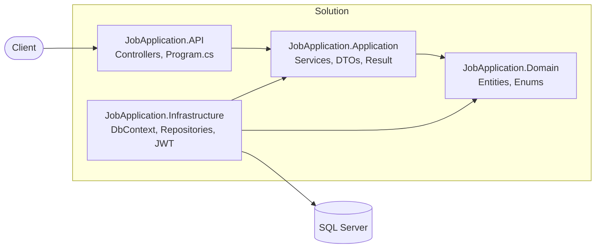
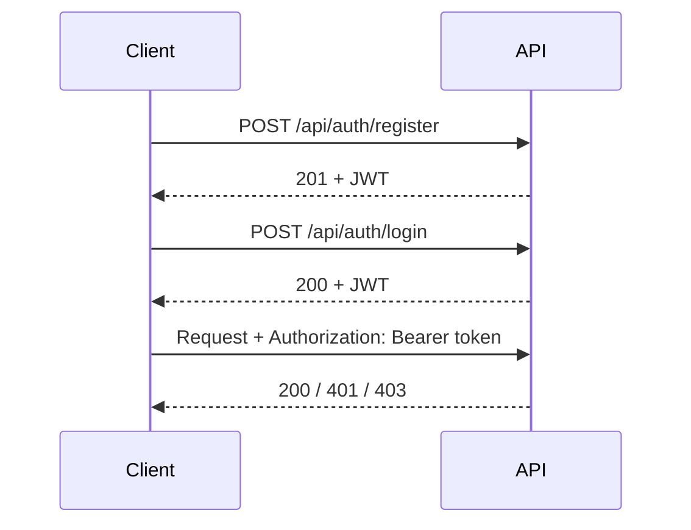
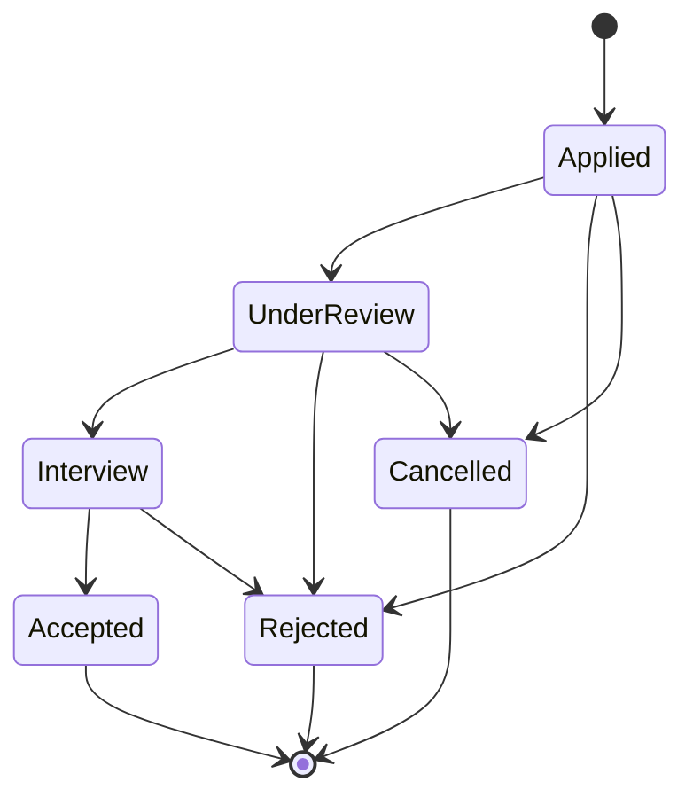

<div align="center">

# 💼 Job Application Management System

**A clean, secure REST API where recruiters publish jobs and candidates apply to them.**


[Features](#-features) •
[Architecture](#-architecture) •
[Getting Started](#-getting-started) •
[API Reference](#-api-reference) •
[Business Rules](#-business-rules) •
[Roadmap](#-roadmap)

</div>

---

## ✨ Features

| | |
|---|---|
| 🔐 **JWT Authentication** | Role-based access for `Candidate` and `Recruiter` |
| 📢 **Jobs** | Create, list, view, update, and close (soft close) |
| 📝 **Applications** | Apply, list, review (status updates), and cancel |
| 🛡️ **Business rules** | Duplicate prevention, valid status transitions, ownership checks |
| 🎯 **Result pattern** | Service results mapped to the right HTTP status codes |
| 📚 **Interactive docs** | Built-in [Scalar](https://scalar.com) API reference |

Built as part of a Back-End Development Bootcamp, following the flow **PRD → Epic → User Stories → Tasks**.

## 🧰 Tech Stack

| Area | Technology |
|---|---|
| Framework | ASP.NET Core Web API on **.NET 9** |
| ORM | Entity Framework Core |
| Database | SQL Server |
| Auth | JWT Bearer, `PasswordHasher<T>` |
| API docs | Built-in OpenAPI + **Scalar** |

## 🏗️ Architecture

Layered architecture with the Repository pattern. Dependencies point inward.



```
JobApplication.sln
├── JobApplication.API             # Controllers and app configuration
├── JobApplication.Application     # DTOs, services, Result pattern
├── JobApplication.Domain          # Entities and enums
└── JobApplication.Infrastructure  # DbContext, repositories, JWT generator, migrations
```

## 🚀 Getting Started

### Prerequisites

- [.NET 9 SDK](https://dotnet.microsoft.com/download/dotnet/9.0)
- SQL Server (LocalDB, Express, or Docker)
- EF Core CLI: `dotnet tool install --global dotnet-ef`

### 1. Clone

```bash
git clone https://github.com/MoSayed335/JobApplication.API
cd JobApplication
```

### 2. Configure the database

In `JobApplication.API/appsettings.json`:

```json
"ConnectionStrings": {
  "DefaultConnection": "Server=.;Database=JobApplicationDb;Trusted_Connection=True;TrustServerCertificate=True"
}
```

### 3. Configure JWT

> ⚠️ Never commit the signing key. Use User Secrets in development.

```bash
dotnet user-secrets init --project JobApplication.API
dotnet user-secrets set "Jwt:Key" "a-random-string-of-at-least-32-characters" --project JobApplication.API
```

```json
"Jwt": {
  "Issuer": "JobApplication.API",
  "Audience": "JobApplication.Client",
  "ExpiryMinutes": 60
}
```

In production, use the environment variable `Jwt__Key`.

### 4. Apply migrations

```bash
dotnet ef database update -p JobApplication.Infrastructure -s JobApplication.API
```

### 5. Run

```bash
dotnet run --project JobApplication.API
```

Open the API reference at **`https://localhost:<port>/scalar/v1`**.

## 🔑 Authentication Flow



The token carries the user's role and `profileId` (the CandidateId or RecruiterId), so IDs are never taken from the request body.

In Scalar, open **Authentication**, choose Bearer, and paste the token.

## 📡 API Reference

### Auth

| Method | Endpoint | Access | Description |
|---|---|---|---|
| `POST` | `/api/auth/register` | 🌐 Anonymous | Create an account (`role`: 1 = Candidate, 2 = Recruiter) |
| `POST` | `/api/auth/login` | 🌐 Anonymous | Get a JWT |

### Jobs

| Method | Endpoint | Access | Description |
|---|---|---|---|
| `POST` | `/api/jobs` | 👔 Recruiter | Create a job |
| `GET` | `/api/jobs?isActive=true` | 🌐 Anonymous | List jobs |
| `GET` | `/api/jobs/{id}` | 🌐 Anonymous | Get a job |
| `PUT` | `/api/jobs/{id}` | 👔 Recruiter (owner) | Update a job |
| `PUT` | `/api/jobs/{id}/close` | 👔 Recruiter (owner) | Close a job |

### Applications

| Method | Endpoint | Access | Description |
|---|---|---|---|
| `POST` | `/api/applications` | 🙋 Candidate | Apply to a job |
| `GET` | `/api/applications?jobId=&status=` | 🔒 Authenticated | Candidates see their own; recruiters see applications for their jobs |
| `PUT` | `/api/applications/{id}/review` | 👔 Recruiter (owner) | Move to the next status |
| `DELETE` | `/api/applications/{id}` | 🙋 Candidate (owner) | Cancel an application |

<details>
<summary><b>Example requests</b></summary>

```http
POST /api/applications
Authorization: Bearer <candidate-token>
Content-Type: application/json

{ "jobId": 1 }
```

```http
PUT /api/applications/5/review
Authorization: Bearer <recruiter-token>
Content-Type: application/json

{ "newStatus": "UnderReview" }
```

If enums are sent as strings, register `JsonStringEnumConverter` in `Program.cs`.

</details>

## 📋 Business Rules

- A candidate can apply only to **active** jobs.
- A candidate cannot apply to the same job twice (a cancelled application does not count).
- Only the job's owning recruiter can review applications or edit and close the job.
- A candidate can cancel only their own application, and only while it is `Applied` or `UnderReview`.
- Closing a job is a soft close (`IsActive = false`); existing applications are kept.

### Application status flow



## 🚦 HTTP Status Codes

| Code | Meaning |
|---|---|
| `201` | Created successfully |
| `400` | Validation failure, inactive job, invalid transition, cancel after Interview |
| `401` | Missing, invalid, or expired token; wrong credentials |
| `403` | Wrong role, or not the owner of the resource |
| `404` | Job or application not found |
| `409` | Duplicate application, job already closed, email already registered |

## 🗺️ Roadmap

- [ ] Refresh tokens
- [ ] Unique filtered index on `(CandidateId, JobId)` to prevent race conditions
- [ ] Pagination for list endpoints
- [ ] Unit tests for services (xUnit + Moq)
- [ ] Rate limiting on `/api/auth/login`
- [ ] Separate `Recruiter` entity

## 👤 Author

**Mohamed** · [@MoSayed335](https://github.com/MoSayed335)

<div align="center">

⭐ If you find this project useful, give it a star.

</div>
